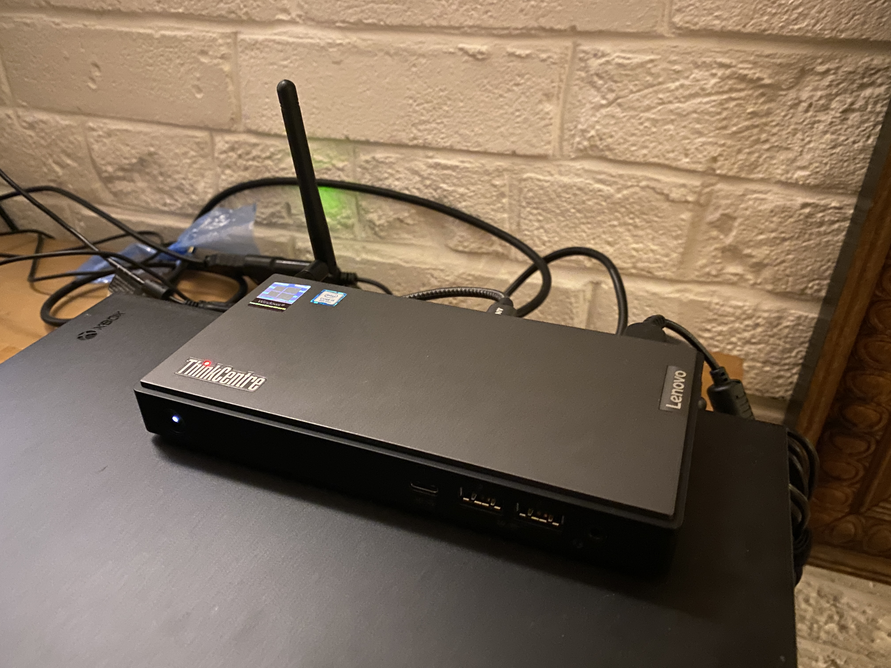

- I've been making small steps towards being able to do dev work on a cloud instance. This week's small steps have been:
    - Adding a [GCE builder](https://github.com/charlieegan3/dev-machine/blob/9093fe25322ca3554a84f5b0ec59a1512fee66df/packer.json#L21-L29) for my dev-machine project. This will allow me to create dev instances in my work GCP account. (I'm not yet using a cloud instance for work, but I plan to be able to at some point as I need to send my laptop off for repair...).
    - Creating a script to upload all my local, secret (and so uncommitted) config files to my password manager ([bitwarden](http://bitwarden.com)). Terribly messy Ruby script [here](https://github.com/charlieegan3/bitwarden-config-sync). This makes it easier to work on multiple machines.
    - I used a tool called *[Algo](https://github.com/trailofbits/algo/blob/master/docs/deploy-to-ubuntu.md#road-warrior-setup)* to setup a VPN instance running on my free f1-micro in GCP. This is going to allow my to connect to services (such as ‘local’ web dev servers) without exposing them to the world. Algo works ok, the system seems to be: deploy the instance, need to change it? Delete it and deploy it again. You can update users but other updates aren’t supported. The small amount of config to do this lives [here](https://github.com/charlieegan3/infrastructure/tree/master/vpn).
    - I also got one of these! This is a Lenovo ThinkCentre m90n. This is going to be my ‘thin client’ while my laptop is away at some point. In the meantime, I’m getting back up to speed with the latest and greatest in the world of Wayland! I’ve been pleasantly surprised at how doable much of what I thought wasn’t now is (it’s been some years since I last tried Wayland). There are lots of quality tools to replace X counterparts, [sway](https://github.com/swaywm/sway), [grim](https://github.com/emersion/grim), [gammastep](https://gitlab.com/chinstrap/gammastep)... I’ve had the most fun getting [wf-recorder](https://github.com/ammen99/wf-recorder) to create a virtual webcam to share my screen... (Wayland screen sharing still a bit WIP in Zoom and I need to have a backup option)

        

- I found this [cool (but sadly insecure) site](http://sortyourmusic.playlistmachinery.com) that sorts Spotify playlists by BPM and other factors. I've been enjoying the slightly random collection of high-bpm tunes. Sadly it was not all my Drum & Bass greatest hits as expected.
- At work, I've been setting up a Postgres database for our application. I found Go lacking a good means of creating different 'suites' with setup and tear down routines. This [testify package](https://github.com/stretchr/testify#suite-package) seems to work quite nicely. With Go, when it's not in the standard library, it can be a bit of a rabbit hole working out what others have done to solve what feels like a common problem. We ended up using [sql-builder](https://github.com/huandu/go-sqlbuilder) to generate queries as it felt the most idiomatic.
- I opened a [PR on a Firefox addon](https://github.com/tiansh/always-in-container/pull/3) I use where I committed my first ever Chinese characters! This addon is helpful as it stops the browser opening a URL before you select a container. This means that rather than opening it in the wrong container, then the right one, you can intercept it and open the URL in the container you want. In the end the maintainer reimplemented it differently but I still got the feature I wanted so I’m happy!
- I also added this [unexciting 404 page](https://charlieegan3.com/404) to my website.
- I hardly played any games this week beyond 30 mins of Warzone. Granny also called to cancel my trip to visit, which I’m actually quite relieved about given the change in COVID circumstances.
